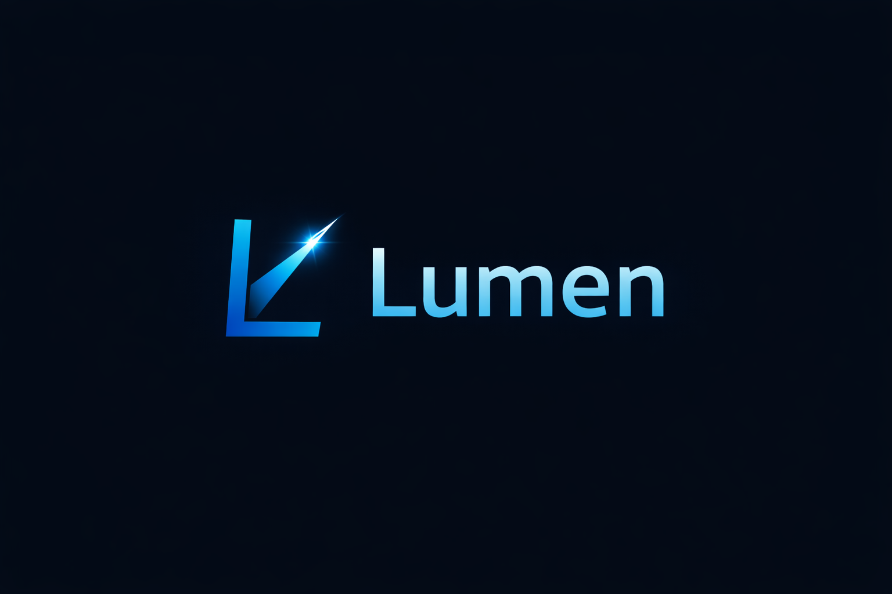

<div align="center">

</div>

<div align="center">


**一个 Kotlin-first 的 Android 图片加载库，面向业务友好、AI 场景、列表场景**

[English](README.md) • [快速开始](#-快速开始) • [特性](#-特性) • [对比](#-与-glide--coil-对比) • [文档](#-文档)

</div>

---

## 🤔 Why（为什么要做）

在 Android 图片加载领域，虽然已有 Glide、Coil 等优秀库，但在实际业务开发中，我们遇到了以下痛点：

1. **状态不透明**：难以精确控制加载状态（Loading / Success / Error / Fallback），业务需要自定义 UI 时不够灵活
2. **链路黑盒**：加载链路不够透明，难以调试和定制（如加密图片、自定义解码等）
3. **RecyclerView 优化不足**：在列表场景中容易出现图片错乱、内存泄漏等问题
4. **Kotlin 特性利用不足**：现有库多为 Java 设计，未能充分利用 Kotlin 的 DSL、协程等特性
5. **AI 场景支持不足**：对于需要解密、自定义解码等 AI 相关场景支持不够友好

**Lumen 的定位**：不是另一个 Glide 克隆，而是为「真实业务 + AI 场景」设计的现代 Android 图片加载库。

---

## ✨ 特性

### 核心特性

- ✅ **状态可控**：清晰的加载状态（Loading / Success / Error / Fallback），支持自定义 UI
  - 基于 Sealed Class 的类型安全状态模型
  - 基于 Flow 的响应式状态更新
  - 支持自定义状态 UI 渲染
  
- ✅ **链路透明**：每一步都可插拔（Fetcher → Decryptor → Decoder → Transformer → Cache）
  - 自定义 Fetcher 支持不同数据源（Network、File、Uri、Resource）
  - 可选的 Decryptor 用于加密图片（AI 场景）
  - 可插拔的 Decoder，集成 BitmapFactory
  - 可链式调用的 Transformer（圆角、旋转、裁剪、模糊）
  - 基于 LruCache 的自动内存缓存管理
  
- ✅ **Kotlin-first**：充分利用 DSL、协程、Flow 等现代 Kotlin 特性
  - DSL 风格的 API 用于请求配置
  - 基于协程的异步加载
  - Flow 用于响应式状态更新
  - 类型安全的 Sealed Class 和 Data Class
  
- ✅ **RecyclerView 优化**：自动取消复用 View 的加载任务，防止内存泄漏和图片错乱
  - View 回收时自动取消任务
  - 基于 View tag 的目标管理
  - 立即显示占位图
  
- ✅ **图片转换**：圆角、旋转、裁剪、模糊等（直接作用于 Bitmap，而非 View）
  - 转换直接作用于 Bitmap 像素
  - 支持链式转换
  - 智能 View 层裁剪（针对某些 scaleType：centerCrop、fitXY）
  
- ✅ **多数据源**：支持 URL、File、Uri、Resource ID、Video
  - 基于 HttpURLConnection 的网络 URL 加载
  - 本地文件系统访问
  - Android ContentProvider Uri 支持
  - Android 资源 ID 支持
  - 视频文件帧提取（File 和 Uri）
  
- ✅ **Compose 支持**：原生 Jetpack Compose 组件和状态管理
  - `LumenImage` 可组合函数，易于集成
  - `rememberLumenState` 用于细粒度状态控制
  - 使用 LaunchedEffect 自动状态管理
  
- ✅ **内存缓存**：基于 LruCache 的自动内存缓存
  - 默认缓存大小：可用内存的 1/8
  - 自动生成缓存 Key（包含数据、解密器、转换器）
  - 线程安全的缓存操作
  
- ✅ **磁盘缓存**：原始图片数据的自动磁盘缓存
  - 默认缓存大小：50MB
  - 基于 LRU 的缓存淘汰策略
  - 存储加密数据（支持"不落明文磁盘"原则）
  - 基于数据源自动生成缓存 Key
  
- ✅ **GIF 动画支持**：自动检测 GIF 并播放动画
  - API 28+ 完整动画支持（使用 ImageDecoder）
  - API < 28 自动降级为静态图片（第一帧）
  - 自动启动动画播放
  - 与现有 API 无缝集成
  
- ✅ **视频帧提取**：从视频文件中提取帧
  - 支持 File 和 Uri 两种数据源
  - 支持提取任意时间点的帧（微秒单位）
  - 支持所有转换器（圆角、模糊等）
  - 提取的帧自动内存缓存
  
- ✅ **渐进式加载**：渐进式 JPEG 加载支持
  - 网络图片的流式加载
  - 渐进式预览显示（从低质量到高质量）
  - 仅对网络 URL 有效
  - 与现有 API 无缝集成
  - 支持所有转换器

### 技术亮点

- 🔄 **协程驱动**：基于 Kotlin Coroutines 和 Flow
  - 所有 I/O 操作在 `Dispatchers.IO` 执行
  - 图片处理在 `Dispatchers.Default` 执行
  - UI 更新在 `Dispatchers.Main` 执行
  - 基于 Flow 的响应式状态发射
  
- 🎭 **状态管理**：Sealed Class 表示加载状态
  - `ImageState.Loading`：加载中
  - `ImageState.Progressive(bitmap, progress)`：渐进式加载预览（低质量预览图）
  - `ImageState.Success(bitmap)`：加载成功（静态图片）
  - `ImageState.SuccessAnimated(drawable)`：加载成功（GIF 动画）
  - `ImageState.Error(throwable)`：加载失败
  - `ImageState.Fallback`：兜底状态，用于自定义处理
  
- 🧩 **模块化设计**：核心逻辑与 UI 分离（内部模块结构）
  - 内部模块：`lumen-core`（纯业务逻辑）、`lumen-view`（ImageView 支持）、`lumen-transform`（图片转换）
  - 📦 **单一依赖**：只需添加一个依赖 - 聚合模块 `lumen` 包含所有功能
  - `lumen`：聚合模块，方便使用
  
- 🛡️ **类型安全**：充分利用 Kotlin 类型系统
  - Sealed Class 用于数据源（`ImageData`）
  - Sealed Class 用于状态（`ImageState`）
  - 类型安全的 DSL API
  - 不可变的 Data Class 用于请求

---

## 🚀 快速开始

### 1. 添加依赖

Lumen 使用 **BOM (Bill of Materials)** 进行版本管理，允许你选择需要的 UI 模块。

#### XML/View 项目

**Maven Central（推荐）：**

```kotlin
repositories {
    mavenCentral()
}

dependencies {
    // BOM 用于版本管理
    implementation(platform("io.github.xichenx:lumen-bom:1.0.0"))
    
    // View 模块，用于 XML/View 项目
    // 自动包含：lumen-core, lumen-transform
    implementation("io.github.xichenx:lumen-view")
}
```

#### Compose 项目

```kotlin
repositories {
    mavenCentral()
}

dependencies {
    // BOM 用于版本管理
    implementation(platform("io.github.xichenx:lumen-bom:1.0.0"))
    
    // Compose 模块，用于 Jetpack Compose 项目
    // 自动包含：lumen-core, lumen-view, lumen-transform
    implementation("io.github.xichenx:lumen-compose")
}
```

> **注意：** 
> - BOM 确保所有模块使用兼容的版本
> - 你只需要选择**一个**模块：`lumen-view`（XML）或 `lumen-compose`（Compose）
> - 所有必需的依赖（`lumen-core`、`lumen-transform`）会自动包含

### 2. 添加权限

```xml
<uses-permission android:name="android.permission.INTERNET" />
```

### 3. 使用（10 行代码）

```kotlin
Lumen.with(context)
    .load("https://example.com/image.jpg") {
        placeholder(R.drawable.placeholder)
        error(R.drawable.error)
        roundedCorners(12f)
    }
    .into(imageView)
```

**就这么简单！** 🎉

---

## 📊 与主流库对比

### 特性对比表

| 特性 | Lumen | Glide | Coil | Fresco | Picasso |
|------|-------|-------|------|--------|---------|
| **Kotlin-first** | ✅ 原生 Kotlin，DSL、协程、Flow | ❌ Java 设计，Kotlin 扩展有限 | ✅ Kotlin-first，协程 | ❌ Java 设计 | ❌ Java 设计 |
| **状态透明** | ✅ Sealed Class，清晰状态（Loading/Success/Error/Fallback） | ⚠️ 状态不够透明 | ⚠️ 状态不够透明 | ⚠️ 状态不够透明 | ⚠️ 状态不够透明 |
| **链路可插拔** | ✅ 每一步都可自定义（Fetcher→Decryptor→Decoder→Transformer→Cache） | ⚠️ 部分可定制 | ⚠️ 部分可定制 | ⚠️ 部分可定制 | ⚠️ 定制有限 |
| **RecyclerView 优化** | ✅ 自动取消，防止错乱 | ✅ 支持 | ✅ 支持 | ✅ 支持 | ⚠️ 需手动取消 |
| **转换作用于** | ✅ Bitmap（直接像素操作） | ❌ View（作用于 ImageView） | ✅ Bitmap | ✅ Bitmap | ❌ View |
| **Compose 支持** | ✅ 原生 Compose 组件 | ⚠️ 需要适配 | ✅ 原生支持 | ❌ 无官方支持 | ❌ 无官方支持 |
| **加密图片支持** | ✅ 内置 Decryptor 接口 | ❌ 需要自定义 | ❌ 需要自定义 | ❌ 需要自定义 | ❌ 需要自定义 |
| **内存管理** | ✅ LruCache，自动内存管理 | ✅ 高级内存管理 | ✅ 自动内存管理 | ✅ Ashmem（Android <5.0），高级 | ⚠️ 基础内存管理 |
| **磁盘缓存** | ✅ 自动磁盘缓存（默认 50MB） | ✅ 自动磁盘缓存 | ✅ 自动磁盘缓存 | ✅ 自动磁盘缓存 | ✅ 自动磁盘缓存 |
| **GIF 支持** | ✅ 完整支持（API 28+），<28 降级 | ✅ 完整支持 | ✅ 完整支持 | ✅ 完整支持 | ❌ 不支持 |
| **视频帧** | ✅ 从视频提取帧 | ❌ 不支持 | ❌ 不支持 | ❌ 不支持 | ❌ 不支持 |
| **WebP 支持** | ✅ 支持 | ✅ 支持 | ✅ 支持 | ✅ 支持 | ✅ 支持 |
| **渐进式加载** | ✅ 支持（仅网络） | ✅ 支持 | ✅ 支持 | ✅ 支持 | ❌ 不支持 |
| **学习曲线** | ⭐⭐ 简单直观 | ⭐⭐⭐ 功能复杂 | ⭐⭐ 相对简单 | ⭐⭐⭐ 配置复杂 | ⭐ 简单 |
| **包体积** | 📦 小（~50KB 核心，模块化） | 📦📦 中等（~475KB） | 📦 小（~200KB） | 📦📦📦 大（~3.4MB） | 📦 小（~120KB） |
| **API 设计** | ✅ 现代 DSL，类型安全 | ⚠️ Builder 模式 | ✅ 现代 Kotlin API | ⚠️ 复杂 API | ✅ 简单 API |
| **协程支持** | ✅ 原生 Flow 支持 | ⚠️ 有限支持 | ✅ 原生支持 | ❌ 不支持 | ❌ 不支持 |
| **成熟度** | 🆕 新项目 | ✅ 非常成熟（2014） | ✅ 成熟（2019） | ✅ 非常成熟（2015） | ✅ 非常成熟（2013） |
| **社区** | 🆕 成长中 | ✅ 大型社区 | ✅ 活跃社区 | ✅ 大型社区 | ⚠️ 活跃度较低 |

### 详细对比

#### **Lumen vs Glide**

| 方面 | Lumen | Glide |
|------|-------|-------|
| **架构** | Kotlin-first，基于 Flow，模块化设计 | 基于 Java，成熟但复杂 |
| **状态管理** | Sealed Class 显式状态 | 隐式状态处理 |
| **定制能力** | 每个管道步骤都可插拔 | 定制点有限 |
| **适用场景** | Kotlin 项目、AI 场景、状态控制 | GIF 支持、成熟生态、Java 项目 |

#### **Lumen vs Coil**

| 方面 | Lumen | Coil |
|------|-------|------|
| **状态管理** | Sealed Class 含 Fallback 状态 | 基础状态处理 |
| **管道透明性** | 完全透明，每步可定制 | 部分透明 |
| **加密支持** | 内置 Decryptor 接口 | 需自定义实现 |
| **适用场景** | AI 场景、加密图片、状态控制 | 通用 Kotlin 项目、Compose 应用 |

#### **Lumen vs Fresco**

| 方面 | Lumen | Fresco |
|------|-------|--------|
| **包体积** | 小（~50KB 核心） | 大（~3.4MB） |
| **内存管理** | 基于 LruCache | 高级 Ashmem（Android <5.0） |
| **Kotlin 支持** | 原生 Kotlin-first | 基于 Java |
| **Compose 支持** | 原生支持 | 无官方支持 |
| **适用场景** | 现代 Kotlin 应用、Compose 项目 | 大型应用、复杂内存场景 |

#### **Lumen vs Picasso**

| 方面 | Lumen | Picasso |
|------|-------|---------|
| **现代特性** | Kotlin-first，协程，Flow | 基于 Java，简单 API |
| **状态管理** | 显式 Sealed Class 状态 | 基于回调的基础状态 |
| **转换** | 作用于 Bitmap | 作用于 View |
| **适用场景** | 现代 Kotlin 项目、状态控制 | 简单项目、最小依赖 |

### 选择建议

- **选择 Lumen**： 
  - ✅ 需要精确的状态控制（Loading/Success/Error/Fallback）
  - ✅ 需要透明、可插拔的管道
  - ✅ AI 场景支持（加密图片、自定义解码）
  - ✅ Kotlin-first 体验，DSL 和协程
  - ✅ Jetpack Compose 项目
  - ✅ 需要小包体积和模块化设计
  - ✅ 需要 GIF 动画支持（API 28+）
  - ✅ 需要视频帧提取
  - ✅ 需要磁盘缓存且支持"不落明文磁盘"
  - ✅ 需要渐进式加载（大图或网络慢的场景）

- **选择 Glide**： 
  - ✅ 需要在较旧 Android 版本（< API 28）上支持 GIF 动画
  - ✅ 需要非常成熟的生态和大量插件
  - ✅ Java 项目或混合 Java/Kotlin 项目
  - ✅ 需要高级缓存策略

- **选择 Coil**： 
  - ✅ 需要轻量级库且支持 Compose
  - ✅ 现代 Kotlin API 和协程
  - ✅ 通用图片加载需求

- **选择 Fresco**： 
  - ✅ 大型应用，复杂内存需求
  - ✅ 需要渐进式图片加载
  - ✅ 需要高级内存管理（特别是 Android <5.0）
  - ✅ 可以接受大库体积（~3.4MB）

- **选择 Picasso**： 
  - ✅ 简单项目，最小需求
  - ✅ 需要尽可能小的库体积
  - ✅ 不需要 GIF 或高级功能

---

## 🎯 适用场景

### ✅ 适用场景

1. **业务友好场景**
   - 需要精确控制加载状态（Loading / Success / Error / Fallback）
   - 需要自定义 UI 展示（如骨架屏、自定义错误 UI）
   - 需要清晰的错误处理和兜底机制

2. **AI 场景**
   - 加密图片加载（内置 Decryptor 接口）
   - 自定义解码逻辑
   - 图片预处理和后处理

3. **列表场景**
   - RecyclerView 中的图片加载
   - 需要防止图片错乱和内存泄漏
   - 需要自动取消复用 View 的加载任务

4. **Kotlin 项目**
   - 纯 Kotlin 项目
   - 使用 Jetpack Compose
   - 需要现代 Kotlin API（DSL、协程、Flow）

5. **图片转换场景**
   - 需要圆角、旋转、裁剪、模糊等转换
   - 需要转换直接作用于 Bitmap（而非 View）
   - 需要链式转换

### ❌ 不适用场景

1. **复杂动画**
   - 不支持图片加载动画（如淡入淡出）
   - 不支持过渡动画

2. **复杂动画**
   - 不支持图片加载动画（如淡入淡出）
   - 不支持过渡动画

4. **Java 项目**
   - 虽然可以在 Java 中使用，但体验不如 Kotlin
   - 建议使用 Glide 或 Coil

5. **需要大量第三方插件**
   - 生态相对较新，第三方插件较少
   - 如需丰富生态，建议使用 Glide

---

## 📝 使用示例

### 基础用法

```kotlin
// 最简单的用法
Lumen.with(context)
    .load("https://example.com/image.jpg")
    .into(imageView)

// 带占位图和错误处理
Lumen.with(context)
    .load("https://example.com/image.jpg") {
        placeholder(R.drawable.placeholder)
        error(R.drawable.error)
    }
    .into(imageView)
```

### 图片转换

```kotlin
// 圆角
Lumen.with(context)
    .load("https://example.com/image.jpg") {
        roundedCorners(20f)
    }
    .into(imageView)

// 链式转换
Lumen.with(context)
    .load("https://example.com/image.jpg") {
        roundedCorners(30f)
        rotate(90f)
        blur(radius = 15f)
    }
    .into(imageView)
```

### Jetpack Compose

**注意：** 如需使用 Compose 功能，使用 `lumen-compose` 模块配合 BOM：

```kotlin
dependencies {
    implementation(platform("io.github.xichenx:lumen-bom:1.0.0"))
    implementation("io.github.xichenx:lumen-core")
    implementation("io.github.xichenx:lumen-compose")
}
```

```kotlin
import com.xichen.lumen.compose.LumenImage

@Composable
fun ImageScreen() {
    LumenImage(
        url = "https://example.com/image.jpg",
        modifier = Modifier.size(200.dp),
        contentDescription = "示例图片",
        block = {
            placeholder(R.drawable.placeholder)
            roundedCorners(20f)
        }
    )
}
```

### RecyclerView 优化

```kotlin
class ImageAdapter : RecyclerView.Adapter<ImageAdapter.ViewHolder>() {
    
    override fun onBindViewHolder(holder: ViewHolder, position: Int) {
        // Lumen 自动处理取消逻辑
        Lumen.with(holder.itemView.context)
            .load(images[position]) {
                roundedCorners(12f)
            }
            .into(holder.imageView)
    }
    
    override fun onViewRecycled(holder: ViewHolder) {
        super.onViewRecycled(holder)
        // 可选：手动取消（Lumen 已自动处理）
        holder.itemView.cancelLumenLoad()
    }
}
```

### 高级用法：自定义 Decryptor

```kotlin
class CustomDecryptor : ImageDecryptor {
    override fun decrypt(input: ByteArray): ByteArray {
        // 自定义解密逻辑
        return decryptedData
    }
    
    override val key: String = "custom_decryptor_v1"
}

Lumen.with(context)
    .load("https://example.com/encrypted-image.jpg") {
        decryptor(CustomDecryptor())
    }
    .into(imageView)
```

### GIF 动画

```kotlin
// 自动检测 GIF 并播放动画（API 28+）
Lumen.with(context)
    .load("https://example.com/animation.gif")
    .into(imageView)
// API 28+ 自动启动动画

// Compose 中使用
LumenImage(
    url = "https://example.com/animation.gif",
    modifier = Modifier.size(200.dp)
)
```

### 视频帧提取

```kotlin
// 从视频文件提取第一帧
Lumen.with(context)
    .loadVideo(videoFile)
    .into(imageView)

// 提取指定时间点的帧（5秒）
val timeUs = 5_000_000L // 5秒 = 5,000,000微秒
Lumen.with(context)
    .loadVideo(videoFile, timeUs)
    .into(imageView)

// 从视频 Uri 提取
Lumen.with(context)
    .loadVideo(videoUri, timeUs)
    .into(imageView)

// 视频帧 + 转换器
Lumen.with(context)
    .loadVideo(videoFile) {
        roundedCorners(16f)
        blur(10f)
    }
    .into(imageView)
```

### 渐进式加载

```kotlin
// 为网络图片启用渐进式加载
Lumen.with(context)
    .load("https://example.com/large-image.jpg") {
        progressiveLoading()  // 启用渐进式加载
        roundedCorners(20f)
    }
    .into(imageView)

// Compose 中使用
LumenImage(
    url = "https://example.com/large-image.jpg",
    modifier = Modifier.size(200.dp),
    block = {
        progressiveLoading()  // 启用渐进式加载
        roundedCorners(20f)
    }
)

// 渐进式加载 + 占位图
Lumen.with(context)
    .load("https://example.com/large-image.jpg") {
        progressiveLoading()
        placeholder(R.drawable.placeholder)
        error(R.drawable.error)
    }
    .into(imageView)
```

### 磁盘缓存管理

```kotlin
// 清空磁盘缓存
lifecycleScope.launch {
    Lumen.with(context).clearDiskCache()
}

// 清空所有缓存（内存 + 磁盘）
lifecycleScope.launch {
    Lumen.with(context).clearCache()
}

// 仅清空内存缓存
Lumen.with(context).clearMemoryCache()
```

---

## 🏗️ 架构设计

### 核心加载链路

```
ImageRequest（不可变 Data Class）
   ↓
[1] 内存缓存检查 → 如果命中，返回缓存的 Bitmap/Drawable
   ↓
[2] 磁盘缓存检查（原始数据） → 如果命中，跳过获取步骤
   ↓
[3] Fetcher（Network / File / Uri / Resource / Video）
   - NetworkFetcher：基于 HttpURLConnection 的网络加载
   - FileFetcher：本地文件系统访问
   - UriFetcher：ContentProvider 访问
   - ResourceFetcher：Android 资源访问
   - Video：直接通过 VideoFrameExtractor 提取帧
   ↓
[4] 磁盘缓存存储（原始数据，解密前）
   - 存储加密数据（支持"不落明文磁盘"）
   - 超过缓存大小时基于 LRU 淘汰
   ↓
[5] Decryptor（可选）
   - 自定义 ImageDecryptor 接口
   - 支持 AI 场景的加密图片
   - 内存中解密（无磁盘 I/O）
   ↓
[6] Decoder（BitmapFactory / ImageDecoder）
   - 静态图片使用 Android BitmapFactory
   - GIF 动画使用 ImageDecoder（API 28+）
   - 自动检测 GIF 格式
   - 支持自定义 BitmapFactory.Options
   - 自动错误处理
   ↓
[7] Transformer（可选：圆角、旋转、裁剪、模糊等）
   - 直接作用于 Bitmap 像素
   - 支持链式转换
   - 针对某些 scaleType 的智能 View 层裁剪
   - 注意：转换器仅适用于静态图片，不适用于 GIF 动画
   ↓
[8] 内存缓存（LruCache）
   - 存储转换后的 Bitmap（静态图片）
   - GIF 动画不缓存（Drawable 不可缓存）
   - 自动生成缓存 Key
   - 线程安全操作
   - 可配置缓存大小
   ↓
[9] Target（ImageView / Compose / Custom）
   - ImageViewTarget：自动 RecyclerView 优化
   - LumenImage：Compose 可组合函数
   - 通过 Flow 收集实现自定义目标
```

**核心原则：每一步都可插拔且透明**

- 每个步骤都是可定制的接口
- 通过 Flow 完全可观察的管道
- 每个步骤都有清晰的错误处理
- 无黑盒操作 - 一切可追踪

### 模块结构

```
Lumen/
 ├── lumen-core        // 核心加载逻辑（无 Android UI 依赖）
 │   ├── Lumen.kt              // 主加载器类
 │   ├── ImageRequest.kt       // 请求模型
 │   ├── ImageState.kt         // 状态模型（Sealed Class）
 │   ├── Fetcher.kt            // 数据获取（Network/File/Uri/Resource）
 │   ├── ImageDecryptor.kt     // 解密接口
 │   ├── Decoder.kt             // Bitmap 解码（静态 + GIF）
 │   ├── BitmapTransformer.kt  // 转换接口
 │   ├── Cache.kt               // 内存缓存（LruCache）+ 磁盘缓存
 │   └── VideoFrameExtractor.kt // 视频帧提取
 │
 ├── lumen-view        // ImageView / ViewTarget / Compose 支持
 │   ├── RequestBuilder.kt     // DSL API 构建器
 │   ├── ImageViewTarget.kt    // ImageView 集成
 │   ├── RecyclerViewExtensions.kt  // RecyclerView 优化
 │   └── compose/
 │       └── LumenImage.kt      // Compose 可组合函数
 │
 ├── lumen-transform   // 图片转换器
 │   ├── RoundedCornersTransformer.kt  // 圆角
 │   ├── RotateTransformer.kt          // 旋转
 │   ├── CropTransformer.kt            // 裁剪
 │   └── BlurTransformer.kt            // 模糊效果
 │
 ├── lumen             // 聚合模块（方便使用）
 └── app               // 示例应用
```

### 状态模型

```kotlin
sealed class ImageState {
    object Loading : ImageState()
    data class Progressive(val bitmap: Bitmap, val progress: Float) : ImageState()  // 渐进式加载预览
    data class Success(val bitmap: Bitmap) : ImageState()              // 静态图片
    data class SuccessAnimated(val drawable: Drawable) : ImageState() // GIF 动画
    data class Error(val throwable: Throwable? = null) : ImageState()
    object Fallback : ImageState()
}
```

---

## 📚 文档

### API 文档

- [核心 API](docs/api-core.md)
- [View API](docs/api-view.md)
- [Compose API](docs/api-compose.md)
- [转换 API](docs/api-transform.md)

### 更多示例

查看 [sample-app](app/) 模块获取完整示例代码。

## 💡 最佳实践

### 1. 磁盘缓存策略

- **存储方式**：磁盘缓存存储原始数据（可能是加密的），在解密之前
- **安全性**：支持"不落明文磁盘"原则 - 解密后的数据永远不会落盘
- **性能**：超过缓存大小限制时自动 LRU 淘汰（默认 50MB）
- **自定义**：创建 `DiskCache` 实例时可以配置缓存大小

```kotlin
// 自定义磁盘缓存大小
val diskCache = DiskCache(context, maxSizeBytes = 100 * 1024 * 1024) // 100MB
val lumen = Lumen.create(context, diskCache = diskCache)
```

### 2. GIF 动画最佳实践

- **API 兼容性**：
  - API 28+：使用 `ImageDecoder` 完整动画支持
  - API < 28：自动降级为静态图片（第一帧）
- **内存**：GIF 动画不存入内存缓存（Drawable 不可缓存）
- **转换器**：转换器不适用于 GIF 动画（仅适用于静态图片）
- **自动播放**：动画自动启动，无需手动调用

### 3. 视频帧提取最佳实践

- **时间单位**：使用微秒（1秒 = 1,000,000微秒）
- **性能**：帧提取在 IO 线程执行，结果会被缓存
- **转换器**：所有转换器都适用于提取的帧
- **缓存**：提取的帧会缓存到内存以提升性能

```kotlin
// 提取 5 秒处的帧
val timeUs = 5_000_000L // 5秒

// 提取视频 30% 时间点的帧
val duration = VideoFrameExtractor.getDuration(context, videoUri)
val timeUs = (duration * 0.3).toLong()
```

### 4. 缓存管理

```kotlin
// 清空内存缓存（同步）
Lumen.with(context).clearMemoryCache()

// 清空磁盘缓存（suspend 函数）
lifecycleScope.launch {
    Lumen.with(context).clearDiskCache()
}

// 清空所有缓存
lifecycleScope.launch {
    Lumen.with(context).clearCache()
}
```

### 5. RecyclerView 优化

- Lumen 在 View 回收时自动取消加载任务
- 大多数情况下无需手动取消
- 占位图立即显示

```kotlin
// 自动处理 - 无需额外代码
override fun onBindViewHolder(holder: ViewHolder, position: Int) {
    Lumen.with(holder.itemView.context)
        .load(images[position])
        .into(holder.imageView)
}
```

### 6. 渐进式加载最佳实践

- **何时使用**：
  - 大图片（> 500KB）或网络较慢的场景
  - 详情页大图
  - 需要提升慢网络下的用户体验
- **何时不使用**：
  - 小图片（< 100KB）- 使用普通加载
  - 列表缩略图 - 使用普通加载
  - 非网络数据源（File、Uri、Resource）- 渐进式加载仅对网络 URL 有效
- **性能**：渐进式加载可以与所有转换器配合使用，但转换器会应用到最终图片，而非预览图

```kotlin
// 最佳实践：大图使用渐进式加载
Lumen.with(context)
    .load("https://example.com/large-image.jpg") {
        progressiveLoading()  // 大图推荐使用
        roundedCorners(20f)
    }
    .into(imageView)

// 最佳实践：小图使用普通加载
Lumen.with(context)
    .load("https://example.com/thumbnail.jpg") {
        // 小图不需要渐进式加载
        roundedCorners(12f)
    }
    .into(imageView)
```

### 7. 错误处理

```kotlin
// 处理不同状态
Lumen.with(context)
    .load(url)
    .into(imageView) // 自动错误处理，显示错误图片

// 或使用 Flow 进行自定义处理
Lumen.with(context)
    .load(request)
    .collect { state ->
        when (state) {
            is ImageState.Success -> { /* 显示图片 */ }
            is ImageState.SuccessAnimated -> { /* 显示 GIF */ }
            is ImageState.Progressive -> { /* 显示渐进式预览 */ }
            is ImageState.Error -> { /* 处理错误 */ }
            is ImageState.Loading -> { /* 显示加载中 */ }
            is ImageState.Fallback -> { /* 显示兜底 UI */ }
        }
    }
```

---

## 🤝 贡献

我们欢迎所有形式的贡献！

### 如何贡献

1. Fork 本仓库
2. 创建特性分支 (`git checkout -b feature/AmazingFeature`)
3. 提交更改 (`git commit -m 'Add some AmazingFeature'`)
4. 推送到分支 (`git push origin feature/AmazingFeature`)
5. 开启 Pull Request

### 开发指南

1. 遵循 Kotlin 编码规范
2. 添加必要的单元测试
3. 更新相关文档
4. 确保所有测试通过

---

## 📄 许可证

本项目采用 Apache License 2.0 许可证。详情请参阅 [LICENSE](LICENSE) 文件。

---

## 🙏 致谢

感谢所有为 Lumen 做出贡献的开发者！

特别感谢 Glide 和 Coil 项目，它们为 Android 图片加载领域做出了巨大贡献。

---

## 📦 发布与分发

Lumen 发布到 **Maven Central**。

### 发布

| 仓库 | Group ID | Artifact ID | 版本 | 状态 |
|------|----------|-------------|------|------|
| Maven Central | `io.github.xichenx` | `lumen` | `0.0.1` | ✅ 官方 |

**示例：**
```kotlin
implementation("io.github.xichenx:lumen:0.0.1")        // Maven Central
```

### 优化的发布工作流

我们使用**统一的 GitHub Actions 工作流**，优化发布流程：

- ✅ **自动化发布**：自动发布到 Maven Central
- ✅ **版本管理**：每个模块独立版本管理
- ✅ **BOM 支持**：BOM 用于版本协调

**工作流结构：**
```
预检查 → 构建 → Maven Central → 最终化
```

详细发布说明请参阅 [PUBLISH.md](PUBLISH.md)。

## 📞 联系方式

- **Issues**: [GitHub Issues](https://github.com/xichenx/lumen/issues)
- **仓库**: [https://github.com/xichenx/lumen](https://github.com/xichenx/lumen)

---

<div align="center">

**如果这个项目对你有帮助，请给一个 ⭐ Star！**

Made with ❤️ by Lumen Team

</div>

